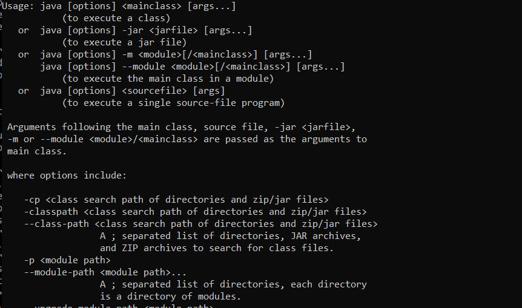
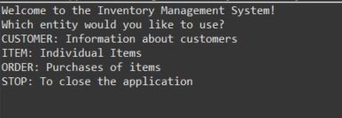
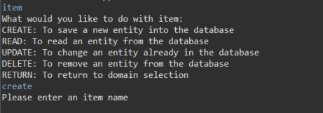

Coverage: 78%
# Inventory Management System (IMS)

This project is an inventory management system which takes user input via the command-line interface. The user can interact with Customers Items and Orders and can create, read, update and delete each. The user can also add items to the orders. This will update the total price of the order and the stock of that item.

## Getting Started

These instructions will detail how to get a copy of the project up and running on a local machine for development and testing purposes. It should be noted that these instructions are based on a Windows system.

### Prerequisites

#### Git

Git is a version control system to track changes to the project and push these changes to the repository. It can be downloaded and installed [here](https://git-scm.com/downloads).

**Installing Git**

* Download the installer and run it.
* Work through the setup pages selecting the most appropriate options, the below are some recommended selections.
* It is recommended that the default branch name is set as main.
* Select to use Git from Git Bash and the command line.

**Configuring Git**

* Open Git Bash then enter the following

```
git config --global user.name "username"
git config --global user.email "email@email.com"
```
* Using the same credentials as GitHub (see below) is recommended.

#### GitHub

GitHub can be used to manage the source control of the project. It is free to sign up for an account [here](https://github.com/).

**Forking the GitHub Repository**

* On GitHub navigate to the main page of the repository.
* The 'Fork' button can be found on the top right-hand side of the screen.
* Click the button to create a copy of the original repository.

**Cloning the Repository to a Local Machine**

* On GitHub navigate to the main page of the repository.
* Above the list of folders and files select Code and in the HTTPS section copy the URL.
* Open Git Bash.
* Using the cd command change the current working directory to the location required for the cloned directory.
* Type git clone and paste in the copied url and press Enter to create the local clone.

#### MySQL Server

MySQL can be used to manage and test the database interactions and can be downloaded and installed [here](https://dev.mysql.com/downloads/windows/installer/8.0.html).

**Installing MySQL Server**

* Download and run the installer.
* Chose custom Setup Type.
* From the select products page select the newest versions of MySQLServer (MySQL Servers), MySQL Workbench (Applications).
* Cycle through the new few options by clicking next or execute.
* On the Accounts and Roles page enter a password for the root account. It is recommended that this is easy to remember and not sensitive (it will be copied to GitHub).
* Cycle through the next few options and on the connecter server page enter the root password to check the connection.
* Cycle through the next few windows and click finish.

**Setting up a MySQL Environment Variable**

* In the Start Menu search for 'env' then select 'edit the system environment variables'.
* Select environment variables.
* At the bottom under system variables select new then enter the following then select ok (note the value should point to the folder where MySQL is installed)


* Still within the system variables select Path then Edit. In the window that opens select New and then at the bottom add %MYSQL_HOME%\bin
* Click OK on all the windows to confirm.
* From the start menu search for MySQL select the MySQL command line client and login using the root password.
* MySQL server should now be set-up. It is recommended that it is used via MySQL Workbench.

#### Java

Java is the back-end development language used for this project downloads for it can be found [here](https://www.oracle.com/java/technologies/downloads/).

**Installing Java**

* Download and run the Java Development kit one of the latest versions.
* Install using default settings.

**Setting up Java Environment Variable**

* In the Start Menu search for 'env' then select 'edit the system environment variables'.
* Select environment variables.
* At the bottom under system variables select new then enter the following then select ok (note the value should point to the folder where Java jdk is installed)


* Still within the system variables select Path then Edit. In the window that opens select New and then at the bottom add %JAVA_HOME%\bin
* Click OK on all the windows to confirm.
* To confirm successful installation open a command prompt and enter java an output similar to the below should be seen.



#### Maven

Maven is used as a build automation tool for the project. It also allows the running of the unit tests it can be downloaded [here](https://maven.apache.org/).

**Installing Maven**

* Download the zip directory.
* Extract the files into an appropriate folder.

**Setting up Maven Environment Variable**

* In the Start Menu search for 'env' then select 'edit the system environment variables'.
* Select environment variables.
* At the bottom under system variables select new twice to enter two new variables M2_HOME and MAVEN_HOME both pointing to the Maven directory (see above for more detailed instructions).
* Still within the system variables select Path then Edit. In the window that opens select New and then at the bottom add %MAVEN_HOME%\bin
* Click OK on all the windows to confirm.
* To confirm successful installation open a command prompt and enter mvn -version.

#### Eclipse

Eclipse has been used as an Integrated Development Environment (IDE) for this project it can be downloaded and installed [here](https://www.eclipse.org/downloads/).

**Installing Eclipse**

* Download and run the installer.
* Select Eclipse IDE for Java Developers.
* Select install.

### Opening and Running the Project

These instructions will detail how to open and run the project in Eclipse.

#### Importing the Project

* Launch Eclipse and select a workspace location. It is recommended that the folder containing the project (not the project folder) is used.
* Select file and Open Projects from file system.
* Click the directory button next to the import source and browse for and select the project folder.
* Click finish. The project folder should now be seen in the Package Explorer to the left of the IDE.

#### Setting Up the Database

* Launch MySQL Workbench.
* Select the local instance and login using the root user and password.
* Take a note of the localhost information.
* In Eclipse the db.properties file in the src/main/resources folder update the database url, username and password to match the local system.
* Open the sql-schema.sql SQL script file in Workbench and execute the statements.

#### Running the Project

* Expand the project folder.
* Right click on the src/main/java folder and select Run As - Java Application
* The application will now be running and the console at the bottom will request user input



* Type and enter the appropriate responses in the terminal to run through the project and create, read, update or delete Customers, Items or Orders.



* Enter return to return to the welcome page and then stop to stop running the application.

## Testing

### Unit Tests 

Unit tests have been written to cover the majority of code in the controller and persistence domain and persistence dao packages. They can be found in the src/test/java folder. The testing coverage of the src/main/java folder is currently at 78% just below industry standard. The main lack of coverage is currently seen in the IMS which contains complicated to test void methods and Utils which manages all user interaction via a Scanner class.


#### Domain

The Classes for the Customer, Item, Order and OrderLineItem entities are found in this folder. Tests have been written to test the constructors, getters and setters and any custom methods.

#### Controllers

Methods controlling the interaction with the user for each entity are found in the controllers classes. These methods call methods in the DAO classes which manage the interaction with the database. All methods in the controller classes have been tested for functionality by using Mockito to mock the response from the user and DAO methods. Tests have been written to verify that each of these mocked methods are called the correct number of times.

#### DAO

The DAO classes manage the interaction with the database with methods to create, read, update and delete table entities. All methods in these files have been tested using an h2 testing database and sample data to ensure that the methods are running correctly and generating the correct returns.

### Running the Tests

To run all the tests right click on the src/test/java folder and select Run As -JUnit test (or Coverage As to see the code coverage). Alternatively right click on the individual test Classes to run these tests alone.

## Deployment

Add additional notes about how to deploy this on a live system

## Built With

* [Maven](https://maven.apache.org/) - Dependency Management

## Versioning

We use [SemVer](http://semver.org/) for versioning.

## Authors

* **Chris Perrins** - *Initial work* - [christophperrins](https://github.com/christophperrins)

## License

This project is licensed under the MIT license - see the [LICENSE.md](LICENSE.md) file for details 

*For help in [Choosing a license](https://choosealicense.com/)*

## Acknowledgments

* Hat tip to anyone whose code was used
* Inspiration
* etc
# IMS-Start
# IMS-Start
